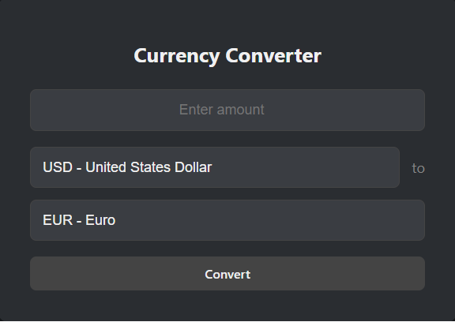

# ConvertApp

## Descripción

Este proyecto es una aplicación de convertidor de divisas construida con React. Utiliza la API pública ExchangeRate-API para permitir a los usuarios ingresar un monto en una divisa y convertirlo a otra divisa. La aplicación soporta varias divisas populares y proporciona un diseño moderno y elegante.

## Deploy de esta aplicacion en Render.

Puedes ingresar y utilizarla en el siguiente link.

https://appwebreact.onrender.com

## Características

- **Entrada de Monto**: Permite ingresar el monto a convertir.
- **Selección de Divisas**: Ofrece un menú desplegable para elegir la divisa de origen y la divisa de destino.
- **Conversión en Tiempo Real**: Calcula y muestra el resultado de la conversión automáticamente cuando se cambian las divisas o el monto.
- **Diseño Elegante**: Interfaz centrada y profesional con un tema oscuro.

## Codigo utilizado

```javaScript

import React, { useState, useEffect } from 'react';
import axios from 'axios';
import '../styles/CurrencyConverter.css';

const CurrencyConverter = () => {
    const [amount, setAmount] = useState('');
    const [fromCurrency, setFromCurrency] = useState('USD');
    const [toCurrency, setToCurrency] = useState('EUR');
    const [result, setResult] = useState(null);

    const currencies = [
        { code: 'USD', name: 'United States Dollar' },
        { code: 'EUR', name: 'Euro' },
        { code: 'GBP', name: 'British Pound Sterling' },
        { code: 'JPY', name: 'Japanese Yen' },
        { code: 'AUD', name: 'Australian Dollar' },
        { code: 'CAD', name: 'Canadian Dollar' },
        { code: 'CHF', name: 'Swiss Franc' },
        { code: 'CLP', name: 'Chillean Pesos' }
    ];

    const handleConversion = async () => {
        if (amount === '') return;
        try {
            const response = await axios.get(`https://v6.exchangerate-api.com/v6/30f1158b553f63c3e8f4d596/pair/${fromCurrency}/${toCurrency}`);
            setResult((response.data.conversion_rate * amount).toFixed(2));
        } catch (error) {
            console.error('Error fetching conversion data:', error);
        }
    };

    // Effect to handle conversion when amount, fromCurrency, or toCurrency change
    useEffect(() => {
        handleConversion();
    }, [amount, fromCurrency, toCurrency]);

    return (
        <div className="currency-converter">
            <h1>Currency Converter</h1>
            <div className="converter-form">
                <input
                    type="number"
                    value={amount}
                    onChange={(e) => setAmount(e.target.value)}
                    placeholder="Enter amount"
                    className="input-amount"
                />
                <div className="currency-select">
                    <select value={fromCurrency} onChange={(e) => setFromCurrency(e.target.value)}>
                        {currencies.map((currency) => (
                            <option key={currency.code} value={currency.code}>
                                {currency.code} - {currency.name}
                            </option>
                        ))}
                    </select>
                    <span>to</span>
                    <select value={toCurrency} onChange={(e) => setToCurrency(e.target.value)}>
                        {currencies.map((currency) => (
                            <option key={currency.code} value={currency.code}>
                                {currency.code} - {currency.name}
                            </option>
                        ))}
                    </select>
                </div>
                <button onClick={handleConversion}>Convert</button>
            </div>
            {result && (
                <div className="conversion-result">
                    <h2>Result: {result} {toCurrency}</h2>
                </div>
            )}
        </div>
    );
};

export default CurrencyConverter;

```

## Tecnologías Utilizadas

- **React**: Biblioteca para construir la interfaz de usuario.
- **Axios**: Para hacer solicitudes HTTP a la API.
- **CSS**: Para estilizar la aplicación.
- **ExchangeRate-API**: API para obtener tasas de conversión de divisas.

## Instalación

1. **Clona el repositorio**:

    ```bash
    git clone https://github.com/tuusuario/tu-repositorio.git
    ```

2. **Navega al directorio del proyecto**:

    ```bash
    cd tu-repositorio
    ```

3. **Instala las dependencias**:

    ```bash
    npm install
    ```

## Uso

1. **Ingresa un monto** en el campo de entrada.
2. **Selecciona la divisa de origen** desde el menú desplegable.
3. **Selecciona la divisa de destino** desde el menú desplegable.
4. **Haz clic en "Convert"** para ver el resultado de la conversión.

## Ejemplos

### Pantalla Principal



## Contribuciones

Las contribuciones son bienvenidas. Si deseas colaborar, sigue estos pasos:

1. **Haz un fork** del repositorio.
2. **Crea una nueva rama** (`git checkout -b feature/nueva-caracteristica`).
3. **Haz tus cambios** y realiza un commit (`git commit -am 'Añadir nueva característica'`).
4. **Sube tu rama** (`git push origin feature/nueva-caracteristica`).
5. **Crea un Pull Request** en GitHub.

## Licencia

Este proyecto está licenciado bajo la [MIT License](LICENSE).
